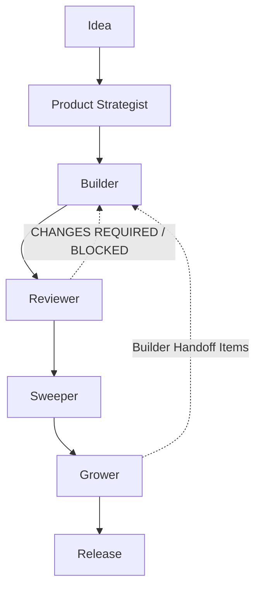
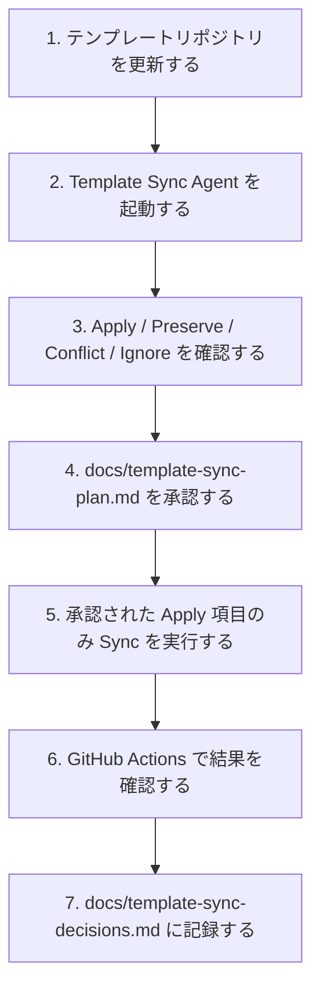
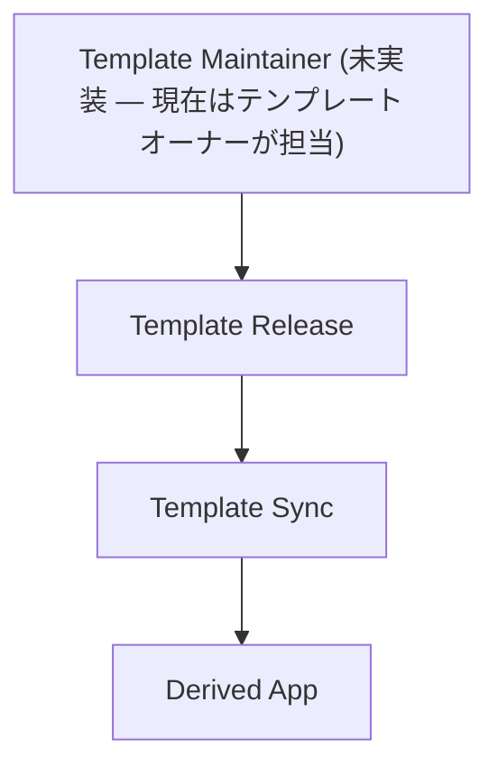

# Django SaaS Subscription Template

> AI Agent-Driven SaaS Template — Django + Stripe + マルチエージェント開発ワークフロー

**v1.0.0+** — 認証・Stripe サブスクリプション・ペイウォールに加え、
Product Strategist / Builder / Sweeper / Grower / Reviewer /
Template Sync という6つの SubAgent と、それらを統合する Agent
Orchestrator を備えた、「意思決定・実装・品質保証・簡素化・成長施策・
テンプレート同期」を AI エージェントに委譲しながら複製して使う Django
テンプレートです。

---

## 1. このリポジトリについて

このリポジトリは、単なる「Django + Stripe の SaaS テンプレート」ではありません。

**AI Agent-Driven SaaS Template** として、以下を提供します。

- **Django + Stripe** による本番運用可能な SaaS の土台
  （認証・サブスクリプション課金・ペイウォール・CI）
- **AI Agent Workflow** による、プロダクト意思決定から実装・品質レビュー・
  簡素化・成長施策までの一連の開発プロセス

「何を作るか」「実装してよいか」「リリースしてよいか」「何を削るべきか」
「どう伸ばすか」を、それぞれ専門化された SubAgent が担当し、各ステップで
人間の承認を必ず挟みます。

新しい SaaS をこのテンプレートから立ち上げる際は、コードだけでなく
この開発プロセスごと複製されることを想定しています。

---

## 2. このテンプレートの思想

このテンプレートは、次の原則の上に成り立っています。

- **Humans make decisions.** — 何を作るか、リリースしてよいかは常に人間が決める。
  AI は提案・実行はするが、最終判断はしない。
- **Agents own responsibilities.** — 各 SubAgent は1つの責務だけを持つ
  （決定 / 実装 / 品質レビュー / 簡素化 / 成長）。他の役割を代行しない。
- **Artifacts are the source of truth.** — Agent 間の連携は口頭指示ではなく、
  `docs/` 配下に保存されたファイル（成果物）を介して行われる。
- **Human approval at every gate.** — 各 Agent は自分の作業計画（Plan）と
  実行結果の両方で必ず停止し、明示的な承認を待つ。沈黙・曖昧な返答・質問は
  承認とみなさない。
- **Single Responsibility.** — Builder は実装のみ、Sweeper は簡素化のみ、
  Grower は成長施策の立案のみ、Reviewer はレビューのみ、Product Strategist
  は意思決定のみを行う。
- **Artifact-driven workflow.** — 1 Agent = 複数の Phase、各 Phase の終わりに
  必ず STOP し、次の Phase には進まない。

詳細は [docs/agent-workflow.md](docs/agent-workflow.md) を参照してください。

---

## 3. Product Development Roles

| Role | Responsibility |
|------|---------------|
| [Product Strategist](.claude/agents/product-strategist.md) | Decide what to build |
| [Builder](.claude/agents/builder.md) | Implement |
| [Reviewer](.claude/agents/reviewer.md) | Review quality |
| [Sweeper](.claude/agents/sweeper.md) | Simplify |
| [Grower](.claude/agents/grower.md) | Improve value |
| [Template Sync](.claude/agents/template-sync.md) | Reconcile template drift |
| Agent Orchestrator（[docs/agent-workflow.md](docs/agent-workflow.md)） | Coordinate agents |

各 Agent の詳細（Purpose / Responsibilities / Inputs / Outputs /
Typical Usage / Common Mistakes）は **[docs/subagents.md](docs/subagents.md)**
にまとめています。

---

## 4. 標準開発フロー

```
Idea
  ↓
Product Strategist
  ↓
Builder
  ↓
Reviewer
  ↓
Sweeper
  ↓
Grower
  ↓
Release
```



Reviewer が CHANGES REQUIRED / BLOCKED と判定した場合、または Grower が
実装を伴う成長施策を承認した場合は、Builder に差し戻されて再度 Reviewer を
通過します。このフロー全体の詳細は [docs/agent-workflow.md](docs/agent-workflow.md)
が正とします。

---

## 5. 成果物（Artifacts）

| File | Owner |
|------|-------|
| `docs/product-definition.md` | Product Strategist |
| `docs/product-decisions.md` | Product Strategist |
| `docs/implementation-plan.md` | Builder |
| `docs/review-plan.md` | Reviewer |
| `docs/review-decisions.md` | Reviewer |
| `docs/sweep-plan.md` | Sweeper |
| `docs/growth-plan.md` | Grower |
| `docs/growth-decisions.md` | Grower |
| `docs/agent-workflow.md` | Agent Orchestrator |

これらのファイルは各 Agent の該当 Phase で初めて生成されます（あらかじめ
空ファイルとして用意されているわけではありません）。`*-decisions.md` の
3ファイルは追記専用（append-only）の SSOT です。

---

## 6. 新しい機能を開発する方法

1. **Product Strategist** — 「何を作るか」を決める。`docs/product-definition.md`
   を生成し、人間が承認するまで次に進まない。
2. **Builder** — 承認された `docs/product-definition.md` を元に実装する。
   `docs/implementation-plan.md` を人間が承認してから初めてコードを書く。
3. **Reviewer** — 実装をレビューする。`docs/review-plan.md` を人間が承認
   してからレビューを実行し、Release Recommendation を出す。
4. **Sweeper** — 不要なコード・重複・複雑さを削る。`docs/sweep-plan.md` を
   人間が承認してから初めてコードを変更する。
5. **Grower** — 活性化・定着・転換率などの成長施策を立案する。
   `docs/growth-plan.md` を人間が承認してから、施策の実行または Builder への
   引き継ぎを行う。

**承認が必要になるタイミング**: 各 Agent は自分の「計画（Plan）」を出した
直後と、「実行結果」を出した直後の、少なくとも2回、必ず停止して人間の承認を
待ちます（詳細は次章 [Human Approval Rules](#7-human-approval-rules)）。
承認なしに次のフェーズへは進みません。

---

## 7. Human Approval Rules

すべての SubAgent は、次の5フェーズ構造で動作します。

```
Phase 1 (調査・分析)
  ↓
Phase 2 (計画の作成)
  ↓
STOP → 人間の承認
  ↓
Phase 3 は人間の承認そのもの
  ↓
Phase 4 (承認された範囲の実行)
  ↓
STOP → 人間の承認
  ↓
Phase 5 (検証・記録・Definition of Done)
```

- **1 invocation = 1 phase** — Agent は1回の呼び出しで1つのフェーズしか
  実行しません。
- **STOP は省略できません** — 自信があっても、次のフェーズには絶対に自動
  継続しません。
- **承認は明示的なものだけが有効です** — 「承認」「進めて」などの明確な
  意思表示が必要で、沈黙・曖昧な返答・質問は承認とみなされません。
- **部分承認が可能です** — 「A だけ承認」「B は保留」のように、計画の一部
  だけを承認して進めることができます。
- **API が切断されても被害は最小限です** — 各フェーズの終わりに必ず状態が
  保存されるため、失われるのは最大でも1フェーズ分だけです。

---

## 8. Repository Structure

```
├── apps/
│   ├── accounts/     # 認証・パスワードリセット・Profile（free_until）
│   ├── billing/      # Stripe Checkout / Webhook / Portal / BillingProfile / sync
│   ├── app/          # サービス固有機能（新機能は必ずここだけに追加）
│   └── common/       # ペイウォールミドルウェア・check_deploy_config・共有ユーティリティ
├── config/           # settings / settings_test / urls / wsgi
├── templates/        # HTML テンプレート（旧系統: accounts / billing / home）
├── ui/               # Sekai UI System（layouts / components、新規ページはこちら）
├── static/           # CSS / 静的ファイル
├── tests/e2e/        # Playwright E2E（既定の pytest からは分離）
├── docs/             # プロダクト・運用・エージェント関連ドキュメント（次章参照）
├── scripts/
│   ├── checks/       # quick_check.sh
│   └── hooks/        # Claude Code 用フック
└── .claude/
    ├── agents/       # SubAgent定義（product-strategist / builder / sweeper / grower / reviewer / template-sync / code-reviewer / prototyper）
    └── skills/       # 専門スキル定義
```

**原則: 新サービスの機能追加は `apps/app/` のみ。** accounts / billing /
common はテンプレートの中核であり、複製後も変更しないことを前提にしています
（詳細は [docs/BOUNDARIES.md](docs/BOUNDARIES.md)）。

---

## 9. Documentation Index

### Agent Workflow

| ドキュメント | 内容 |
|---|---|
| [docs/agent-workflow.md](docs/agent-workflow.md) | Agent Orchestrator。実行順序・成果物の受け渡し・標準フロー・リリース条件の SSOT |
| [docs/subagents.md](docs/subagents.md) | 各 SubAgent の Purpose / Responsibilities / Inputs / Outputs / Typical Usage / Common Mistakes |
| [docs/quick-start.md](docs/quick-start.md) | ユースケース別（新機能追加・簡素化・成長施策・リリース・派生アプリ更新）のエージェント利用ガイド |

### Agent Definitions

`.claude/agents/` 配下の SubAgent 定義ファイル一覧です（[Product
Development Roles](#3-product-development-roles) と対応する
ゲート型 5フェーズ SubAgent 6件）。**Agent Orchestrator はここに
含まれません** — docs/agent-workflow.md 自身が明記する通り Agent
Orchestrator は SubAgent ではなく `.claude/agents/` に定義ファイルを
持たないため（実体は [docs/agent-workflow.md](docs/agent-workflow.md)）。

| ドキュメント | Purpose |
|---|---|
| [.claude/agents/product-strategist.md](.claude/agents/product-strategist.md) | 何を作るかを決める（Product Decision ONLY） |
| [.claude/agents/builder.md](.claude/agents/builder.md) | 承認済みの製品定義を実装する（Implementation ONLY） |
| [.claude/agents/reviewer.md](.claude/agents/reviewer.md) | 実装品質・ガバナンスをレビューする（Review ONLY） |
| [.claude/agents/sweeper.md](.claude/agents/sweeper.md) | 不要なコード・複雑さを削る（Simplification ONLY） |
| [.claude/agents/grower.md](.claude/agents/grower.md) | 成長施策を立案・検証する（Growth Diagnosis ONLY） |
| [.claude/agents/template-sync.md](.claude/agents/template-sync.md) | テンプレートと派生アプリの差分を同期する（Template Drift Management ONLY） |

### プロダクト管理

| ドキュメント | 内容 |
|---|---|
| [docs/product-context.md](docs/product-context.md) | プロダクトの前提（ビジョン・対象ユーザー・課金戦略） |
| [docs/mvp-scope.md](docs/mvp-scope.md) | MVP スコープ |
| [docs/vision.md](docs/vision.md) | 長期ビジョン |
| [docs/pricing.md](docs/pricing.md) | 価格戦略 |
| [docs/roadmap.md](docs/roadmap.md) | ロードマップ |
| [docs/metrics.md](docs/metrics.md) | 主要指標 |
| [docs/experiments.md](docs/experiments.md) | 実験ログ |
| [docs/user-feedback.md](docs/user-feedback.md) | ユーザーフィードバック |
| [docs/growth-decisions.md](docs/growth-decisions.md) | Grower の意思決定ログ（SSOT） |
| docs/product-definition.md / docs/product-decisions.md（生成物） | Product Strategist の成果物（SSOT） |
| docs/implementation-plan.md（生成物） | Builder の成果物 |
| docs/review-plan.md / docs/review-decisions.md（生成物） | Reviewer の成果物（SSOT） |
| docs/sweep-plan.md（生成物） | Sweeper の成果物 |
| docs/growth-plan.md（生成物） | Grower の成果物 |
| docs/template-sync-plan.md（生成物） | Template Sync Agent の成果物（派生アプリで実際に実行された時に初めて生成される） |
| docs/template-sync-decisions.md（生成物） | Template Sync Agent の同期履歴ログ（SSOT、append-only） |

### 運用・アーキテクチャ

| ドキュメント | 内容 |
|---|---|
| [docs/RUNBOOK.md](docs/RUNBOOK.md) | 運用手順・障害対応・セキュリティ |
| [docs/TEMPLATE_CHECKLIST.md](docs/TEMPLATE_CHECKLIST.md) | 新 SaaS を2週間で立ち上げるチェックリスト |
| [docs/SETUP_STRIPE.md](docs/SETUP_STRIPE.md) | Stripe セットアップ |
| [docs/sync_billing_from_stripe.md](docs/sync_billing_from_stripe.md) | 課金状態復旧コマンド |
| [docs/UI_SYSTEM_UPDATE_RUNBOOK.md](docs/UI_SYSTEM_UPDATE_RUNBOOK.md) | UI システム更新手順 |
| [docs/architecture.md](docs/architecture.md) | アーキテクチャ概要 |
| [docs/BOUNDARIES.md](docs/BOUNDARIES.md) | 変更してよい領域・いけない領域 |
| [docs/Guidelines.md](docs/Guidelines.md) | 日常の開発ルール |
| [docs/Workflows.md](docs/Workflows.md) | コミット規律・Spec→Code→Review ワークフロー |
| [docs/CodexReviewPrompt.md](docs/CodexReviewPrompt.md) | Codex レビュー用プロンプト |
| [docs/template-evolution.md](docs/template-evolution.md) | テンプレート自体の改善履歴・提案 |
| [docs/adr/](docs/adr/) | Architecture Decision Records |
| [docs/ai-context/](docs/ai-context/) | AI 開発用コンテキスト |

---

## 10. Quick Start（ユースケース別）

### 新機能追加

```
Product Strategist → Builder → Reviewer → (Sweeper) → (Grower)
```
`docs/product-definition.md` の承認から始めます。詳細は
[docs/quick-start.md](docs/quick-start.md) の「新機能開発フロー」。

### コード簡素化

```
Sweeper → Reviewer
```
不要なコード・重複・複雑さを削る際に使います。詳細は
[docs/quick-start.md](docs/quick-start.md) の「簡素化フロー」。

### 成長施策検討

```
Grower → (Builder → Reviewer)
```
活性化・定着・転換率・価格の改善仮説を立てる際に使います。詳細は
[docs/quick-start.md](docs/quick-start.md) の「成長施策フロー」。

### リリース前レビュー

```
Reviewer
```
実装品質・アーキテクチャ・セキュリティ・ガバナンス・リリース判定を行います。
詳細は [docs/quick-start.md](docs/quick-start.md) の「リリースフロー」。

---

## 11. System Architecture


詳細は [docs/architecture.md](docs/architecture.md) を参照してください。

---

## 12. Features

### Authentication

- **Email / Password 認証** — カスタム User モデル（`USERNAME_FIELD = email`）、`?next=` 対応
- **パスワードリセット** — Django 標準ビューベース。未登録メールでも同一応答を返す
  列挙防止設計。メール送信は開発では console backend（設定不要）、本番は SMTP
- **ログイン防御** — django-axes によるアカウント単位ロックアウト（5回失敗で1時間）
- **レートリミット** — サインアップ 10回/時・パスワードリセット申請 5回/時（IP 単位）。
  リセットの制限超過時も通常画面へ遷移し、制限の存在自体を観測不能にする

### Billing

- **Stripe Checkout** — サブスクリプション作成は Checkout のみ。単一プラン 980 JPY/月
- **Customer Portal** — 解約・支払い方法変更は Stripe Customer Portal に委譲
- **サブスクリプション管理** — 登録後7日間の無料期間は `Profile.free_until` の
  アプリケーションロジックで管理（Stripe の trial 機能は不使用）。
  障害時は `sync_billing_from_stripe` コマンドで Stripe から状態を復旧
- **Webhook（課金状態の単一の正）** — 署名検証・イベント重複排除・順序逆転ガード・
  price 検証（fail-closed）・deleted 先行到着対策・同一 Stripe アカウント共有時の
  他サービスイベント誤爆防止・バージョン付き idempotency key
- **ペイウォール** — `/app/` 配下すべてをミドルウェアで保護。
  無料期間内 または `status == active` のみアクセス可、それ以外は pricing へリダイレクト

### Quality

- **pytest** — 112 テスト（認証・レートリミット・課金ライフサイクル・Webhook エッジケース・
  ペイウォール・設定チェック）。`config.settings_test` により **`.env` なしで実行可能**
- **Playwright E2E** — ブラウザテスト。`pytest tests/e2e` で通常テストと分離実行
- **GitHub Actions** — push ごとに test / e2e の2ジョブ + 本番相当設定での
  `check_deploy_config --fail-on-warning`
- **check_deploy_config** — DEBUG / SECRET_KEY / SITE_URL / ALLOWED_HOSTS / CSRF /
  Stripe キー / EMAIL backend / 送信元アドレスの10項目をデプロイ前に検証
- **quick_check.sh** — compileall + Django check + pytest を一括実行するローカル品質ゲート

---

## 13. Technology Stack

| 分類 | 技術 |
|---|---|
| Backend | Django 5.1 / Python 3.11+（3.12 サポート、3.14 非対応） |
| Database | PostgreSQL（本番・Railway）/ SQLite（ローカル開発） |
| Frontend | Django Templates + Tailwind CSS（フロントエンドフレームワーク不使用） |
| Billing | Stripe（Checkout / Customer Portal / Webhook） |
| Infrastructure | Railway / Gunicorn / WhiteNoise / GitHub Actions |
| Security | django-axes（ログインロックアウト） |
| Testing | pytest / pytest-django / Playwright |

依存管理は `requirements.txt`（本番）と `requirements-dev.txt`（開発、本番分を include）の2ファイル。

---

## 14. Local Development Setup

30分以内にローカルで起動できます（Stripe キーはダミーで可）。

```bash
# 1. clone
git clone https://github.com/kojiito-sekaiinc/saas_template.git
cd saas_template

# 2. 仮想環境
python -m venv .venv
source .venv/bin/activate        # Windows: .venv\Scripts\activate

# 3. 依存パッケージ（開発用: pytest / Playwright 含む）
pip install -r requirements-dev.txt

# 4. 環境変数
cp .env.example .env
# 最低限の編集（開発用）:
#   SECRET_KEY=your-secret-key
#   DEBUG=True
#   STRIPE_SECRET_KEY=sk_test_dummy
#   STRIPE_PRICE_ID=price_dummy
#   STRIPE_WEBHOOK_SECRET=whsec_dummy

# 5. DB セットアップ（未設定なら SQLite）
python manage.py migrate

# 6. 管理者作成
python manage.py createsuperuser

# 7. 起動
python manage.py runserver
```

アクセス:

- トップページ: http://localhost:8000
- サインアップ: http://localhost:8000/accounts/signup/
- アプリ領域（ペイウォール内）: http://localhost:8000/app/
- 管理画面: http://localhost:8000/admin/

パスワードリセットのメールは、開発では console backend により
runserver のターミナルに本文（リンク含む）が出力されます。

---

## 15. Quality Gates

テストランナーは **pytest** に統一されています（`python manage.py test` は使用しない）。
テストは `config.settings_test` を使うため **`.env` なしで実行できます**。

```bash
# 単体・結合テスト（tests/e2e は収集されない）
pytest

# アプリを絞って実行
pytest apps/billing/
pytest apps/accounts/

# Playwright E2E（初回は playwright install chromium が必要）
pytest tests/e2e

# Django システムチェック
python manage.py check

# 一括品質ゲート（compileall + Django check + pytest）
./scripts/checks/quick_check.sh

# デプロイ前設定チェック（本番 env を読み込んだ状態で）
python manage.py check_deploy_config --fail-on-warning
python manage.py check_deploy_config --json   # CI / スクリプト連携用
```

**check_deploy_config の出力例（本番想定）:**

```
OK       DEBUG                    DEBUG=False
OK       SITE_URL                 https://example.com
OK       ALLOWED_HOSTS            example.com
OK       SITE_URL_IN_ALLOWED_HOSTS example.com in ALLOWED_HOSTS
OK       CSRF_TRUSTED_ORIGINS     ok
OK       STRIPE_SECRET_KEY        set
OK       STRIPE_PRICE_ID          price_live_xxx
OK       STRIPE_WEBHOOK_SECRET    set
OK       EMAIL_BACKEND            django.core.mail.backends.smtp.EmailBackend
OK       DEFAULT_FROM_EMAIL       noreply@yourdomain.com

Summary: ok=10 warning=0 error=0
```

ERROR が1件でもあると exit(1) になります。GitHub Actions では push ごとに
本番相当の環境変数でこのチェックが実行されます。

---

## 16. Environment Variables

`.env.example` をコピーして使います。「必須」は本番デプロイ時の要否です。

| Variable | 説明 | 必須 |
|---|---|---|
| `SECRET_KEY` | Django シークレットキー。`DEBUG=False` では未設定だと起動しない | **Yes** |
| `DEBUG` | デバッグモード。デフォルト `False`（fail-closed） | No |
| `ALLOWED_HOSTS` | 許可ホスト名（カンマ区切り）。デフォルトは localhost のみ | **Yes** |
| `SITE_URL` | サイトの Base URL。Stripe リダイレクトに使用 | **Yes** |
| `CSRF_TRUSTED_ORIGINS` | CSRF 許可オリジン。HTTPS の SITE_URL から自動補完 | No |
| `DATABASE_URL` | PostgreSQL 接続 URL。空なら SQLite | **Yes** |
| `STRIPE_SECRET_KEY` | Stripe シークレット API キー | **Yes** |
| `STRIPE_PRICE_ID` | サブスクリプション用 Price ID | **Yes** |
| `STRIPE_WEBHOOK_SECRET` | Webhook 署名シークレット | **Yes** |
| `SITE_NAME` | ブランド名（navbar / タイトル / メールに表示） | No（推奨） |
| `EMAIL_BACKEND` | メール送信 backend。本番は SMTP を指定 | **Yes**（メール送信時） |
| `EMAIL_HOST` / `EMAIL_PORT` / `EMAIL_HOST_USER` / `EMAIL_HOST_PASSWORD` / `EMAIL_USE_TLS` | SMTP 接続情報。`EMAIL_USE_TLS` は true/1/yes を許容 | **Yes**（メール送信時） |
| `DEFAULT_FROM_EMAIL` | 送信元メールアドレス | **Yes**（メール送信時） |
| `TRUSTED_PROXY_COUNT` | 信頼するリバースプロキシ数（Railway 本番: `1`） | No（本番は `1` 推奨） |
| `DJANGO_STATICFILES_MANIFEST` | WhiteNoise manifest モード（cache-busting）。`collectstatic` 前提 | No |

未設定の EMAIL_BACKEND は console backend にフォールバックします（開発用）。
本番で console のままだと `check_deploy_config` が **ERROR** で検出します。

---

## 17. Deployment

Railway を前提としています。

1. **GitHub リポジトリを接続** し、環境変数を設定（[Environment Variables](#16-environment-variables) 参照）
   - `SECRET_KEY` は必ず本番用に新規生成
   - `SITE_URL` は本番ドメイン（https）に設定
   - `STRIPE_*` は本番キーに切り替え
   - `EMAIL_BACKEND` に SMTP backend、`EMAIL_HOST` 等の接続情報、
     `DEFAULT_FROM_EMAIL` に独自ドメインのアドレスを設定
   - `TRUSTED_PROXY_COUNT=1` を設定
2. **Stripe Webhook を本番 URL で登録**
   - endpoint: `{SITE_URL}/stripe/webhook`
   - events: `customer.subscription.created` / `updated` / `deleted`
   - 手順の詳細: [docs/SETUP_STRIPE.md](docs/SETUP_STRIPE.md)
3. **デプロイ前チェックを必ず実行**

   ```bash
   python manage.py check_deploy_config --fail-on-warning
   ```

4. Deploy

### 本番前の必須対応・制約

- **Tailwind CDN の置き換え**: `ui/layouts/base.html` は開発用に Tailwind Play CDN を
  使用しています。本番では CSS をビルドして静的ファイルに置き換えてください
  （手順: [docs/UI_SYSTEM_UPDATE_RUNBOOK.md](docs/UI_SYSTEM_UPDATE_RUNBOOK.md)）
- **レートリミットは LocMemCache**: Gunicorn シングルワーカー・単一インスタンスが前提。
  水平スケール時は Redis（django-redis）へ切り替えてください
- **ログイン防御の範囲**: django-axes はアカウント単位ロックアウトのみ。
  IP を変えながらの credential stuffing はカバー外（意図的なトレードオフ、
  詳細: [docs/RUNBOOK.md](docs/RUNBOOK.md)）
- **課金障害からの復旧**: Webhook 取りこぼし時は `python manage.py
  sync_billing_from_stripe`（詳細: [docs/sync_billing_from_stripe.md](docs/sync_billing_from_stripe.md)）

---

## 18. Creating a New SaaS

このテンプレートから新サービスを立ち上げる手順の完全版は
**[docs/TEMPLATE_CHECKLIST.md](docs/TEMPLATE_CHECKLIST.md)**（2週間リリース手順）にあります。要点:

1. **リポジトリ複製** — GitHub の「Use this template」で新規リポジトリを作成
2. **ブランド設定** — `.env` の `SITE_NAME` を変更（navbar / タイトル / メールに反映）
3. **デモデータ削除** — `apps/app/views.py` の `_FAKE_CUSTOMERS` と
   customer_list / customer_create ビューは UI デモ用の仮実装。
   実モデルに置き換えるか削除する
4. **Stripe 設定** — サービスごとに **Stripe アカウントを分離**することを推奨
   （Webhook イベントの相互干渉を防ぐ。詳細: [docs/SETUP_STRIPE.md](docs/SETUP_STRIPE.md)）。
   Product / Price 作成 → キー3種を `.env` に設定
5. **メール設定** — 本番 SMTP（SendGrid / Amazon SES / Resend 等）と
   `DEFAULT_FROM_EMAIL` を独自ドメインで設定
6. **機能実装** — 新機能は `apps/app/` のみに追加。
   課金・認証・ペイウォールのコアは変更しない。開発は
   [Product Development Roles](#3-product-development-roles) の
   SubAgent フローに従う

### Updating an Existing Derived App

新規立ち上げとは逆に、**既にリリース済みの派生アプリへテンプレート側の
更新を反映したい場合**は [Template Sync](#21-template-sync)
（[.claude/agents/template-sync.md](.claude/agents/template-sync.md)）
を使います。

```
1. テンプレートリポジトリを更新する
   ↓
2. 派生アプリ側で Template Sync Agent を起動する
   ↓
3. Apply / Preserve / Conflict / Ignore の分類を確認する
   ↓
4. docs/template-sync-plan.md を承認する（部分承認可）
   ↓
5. 承認された Apply 項目のみ Sync を実行する
   ↓
6. GitHub Actions（CI）で結果を確認する
   ↓
7. docs/template-sync-decisions.md に同期履歴を記録する
```



詳細な責務・フェーズ構成は [Template Sync](#21-template-sync) 章を
参照してください。

---

## 19. Roadmap

v1.1 候補（v1.0.0 リリースレビューでのフォローアップ合意事項 + 既知の制約）:

- **フロントエンド統一** — 旧系統（`templates/` + `static/css/app.css`）と
  Sekai UI 系（`ui/` + Tailwind）の2系統混在を Sekai UI 系へ統一
- **Tailwind ローカルビルド** — Play CDN 依存をやめ、ビルド済み CSS を標準化
- **Webhook ガード強化** — 同一 customer に複数 subscription が並存した場合の
  deleted イベントによる上書き防止
- **check_deploy_config 拡充** — SMTP backend 選択時の `EMAIL_HOST` 未設定検出
- **リセットメールのドメイン固定** — Host ヘッダ由来ではなく `SITE_URL` から生成
- **Redis レートリミット** — 複数ワーカー / 水平スケール対応

Template Sync 関連（将来検討）:

- **Template Maintainer Agent** — 現在は人間のテンプレートオーナーが
  担当している `docs/template-evolution.md` の Proposed/Accepted
  キュレーションとテンプレートリリース判断を SubAgent 化する
- **Automatic Drift Detection** — テンプレートと派生アプリの差分を
  定期的に自動検知し、Template Sync の Analyze フェーズ相当を
  スケジュール実行する
- **GitHub PR-based Template Sync** — Sync Execution の結果をローカル
  コミットではなく Pull Request として提案する運用への対応
- **Multi-template Support** — 複数バージョン・複数派生元テンプレート
  からの同期先切り替え対応

---

## 20. License

現時点で LICENSE ファイルは同梱していません（プライベートテンプレート、All rights reserved）。
テンプレートとして公開・配布する場合は、利用条件を定めた LICENSE の追加を検討してください。

---

## 21. Template Sync

**v1.0.0+** で導入された [Template Sync](.claude/agents/template-sync.md)
は、このテンプレート本体の更新を、派生アプリへ安全に反映するための
SubAgent です。テンプレートと派生アプリの「食い違い（Template
Drift）」を検出し、どの差分を取り込むべきか、どの差分を派生アプリ固有
として守るべきかを整理します。

### Template Lifecycle Flow

これは [標準開発フロー](#4-標準開発フロー)（Idea → Release）とは別軸の
フローです。標準開発フローが「1つの派生アプリの中で何をどう作るか」を
扱うのに対し、Template Lifecycle Flow は「テンプレート本体の改善を、
既に存在する派生アプリへどう届けるか」を扱います。

```
Template Maintainer（将来追加予定。現在はテンプレートオーナーが担当）
      ↓
Template Release
      ↓
Template Sync
      ↓
Derived App
```



### Template Sync Agent

**Purpose**: テンプレート本体と派生アプリの差分（Template Drift）を
安全に管理する。Template Drift Management ONLY — 製品判断・新機能実装・
リファクタリング・成長施策・レビュー代行・テンプレート自体の改善提案は
行いません（詳細な責務境界は [.claude/agents/template-sync.md](.claude/agents/template-sync.md)）。

**Responsibilities**:

- Template Drift Analysis（テンプレートと派生アプリの差分分析）
- Apply / Preserve / Conflict / Ignore への分類
- 派生アプリ固有実装の保護
- 承認済み課金戦略（例: Section 4-bis 承認済みの Freemium）の保護
- CI（GitHub Actions）確認
- 同期履歴の記録（`docs/template-sync-decisions.md`）

**Workflow**: 他の SubAgent と同じ、5フェーズ・STOP ゲート方式です。

```
Analyze
 ↓
Sync Plan
 ↓
Human Approval
 ↓
Sync Execution
 ↓
Verification
```

各フェーズでの編集権限は固定ではなくフェーズごとに定義されており、
Sync Execution フェーズは人間が明示的に承認した Apply 対象ファイルのみ
変更できます。push は Verification フェーズで、ユーザーが明示的に
承認した場合のみ行われます（詳細:
[.claude/agents/template-sync.md](.claude/agents/template-sync.md)）。

### Template Source Locking

Template Sync Agent は、同期元となるテンプレートを Analyze フェーズで
以下の情報として固定します。

```
Repository
Branch
Commit SHA
Fetch Time
```

Sync Plan・Sync Execution の各フェーズは、この Analyze フェーズで
固定した Commit SHA を同期元として使い続けます。これにより、Analyze
の後にテンプレート側の `main` ブランチが更新されても、同期対象が
途中で変わらないことを保証します。

### Drift Classification

| Category | Meaning |
|----------|----------|
| Apply | 安全に同期する |
| Preserve | 派生アプリ側を優先する |
| Conflict | 人間の判断が必要 |
| Ignore | 同期不要 |

#### Typical Preserve Examples

- `apps/app/**`
- `templates/app/**`
- `tests/e2e/**`
- Product Docs（`docs/product-context.md` / `docs/mvp-scope.md` /
  `docs/product-definition.md` / `docs/product-decisions.md` /
  `docs/growth-decisions.md`）
- 承認済みの Freemium など、派生アプリ固有の Billing Strategy
  （CLAUDE.md Section 4-bis 承認済み）

#### Typical Conflict Examples

- billing / paywall 関連コード
- `apps/common/middleware.py`
- `config/settings.py`
- `page_header.html` のような、派生アプリ側の既知バグ修正と
  テンプレート更新が衝突するケース
- CI configuration

### Typical Use Cases

- テンプレート側で README の運用ドキュメントが更新された →
  派生アプリにも Apply で反映したい
- テンプレート側で Sekai UI（`ui/` 配下）のコンポーネントが更新された
  → 派生アプリの UI 更新を Apply で取り込みたいが、派生アプリ側で
  独自にカスタマイズした画面は Preserve / Conflict として区別したい
- テンプレート側で billing / paywall 関連コードに変更が入った →
  事故りやすい領域のため自動 Apply はせず、Conflict として人間の
  判断に委ねたい
- 派生アプリが Section 4-bis 承認済みの Freemium など独自の Billing
  Strategy を採用している → テンプレートのデフォルト課金ロジックで
  上書きされないよう Preserve として保護したい
