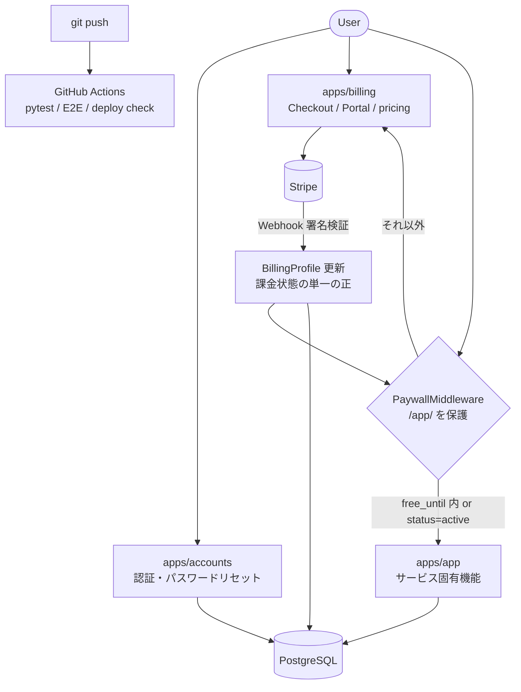

# Django SaaS Subscription Template

> Production-ready Django SaaS Template for AI-assisted development.

**v1.0.0** — メール認証・7日間無料トライアル・Stripe サブスクリプション・
Webhook ベースの課金同期・ペイウォールを備えた、複製して使う Django テンプレート。

---

## 1. Overview

### 目的

このリポジトリは一回きりのアプリケーションではなく、**再利用可能な SaaS テンプレート**です。

- 新サービスを **約2週間サイクル** でリリースする
- **有料サブスクリプション** で実需要を検証する
- 複製しても壊れない、安全で安定した土台を維持する

### 対象ユーザー

- 個人開発で SaaS を作りたいエンジニア
- Stripe 課金を最短で実装したい方
- Claude Code など AI エージェントを使った開発を前提にしたい方

### v1.0.0 の概要

認証（サインアップ / ログイン / パスワードリセット）、Stripe サブスクリプション課金、
ペイウォール、デプロイ前設定チェック、CI（unit + E2E）、AI 開発ワークフローまでを含む
初の production-ready リリースです。112 件の pytest と Playwright E2E が CI で常時実行されます。

### Philosophy

This template is designed to help individual developers build production-ready
SaaS applications with AI-assisted development.

It prioritizes:

- **Simplicity** — 単一プラン・固定スタック・「迷ったら追加より削除」
- **Production readiness** — fail-closed なデフォルト設定・デプロイ前チェック・CI
- **Fail-closed security** — Webhook を課金状態の単一の正とし、疑わしいイベントは拒否
- **Incremental improvement** — 小さな目的別コミットとレビュー駆動の改善
- **Reusable architecture** — 新機能は `apps/app` のみ。コアは複製後も変更しない

---

## Architecture



詳細は [docs/architecture.md](docs/architecture.md) を参照してください。

---

## 2. Features

### Authentication

- **Email / Password 認証** — カスタム User モデル（`USERNAME_FIELD = email`）、`?next=` 対応
- **パスワードリセット** — Django 標準ビューベース。未登録メールでも同一応答を返す
  列挙防止設計。メール送信は開発では console backend（設定不要）、本番は SMTP
- **ログイン防御** — django-axes によるアカウント単位ロックアウト（5回失敗で1時間）
- **レートリミット** — サインアップ 10回/時・パスワードリセット申請 5回/時（IP 単位）。
  リセットの制限超過時も通常画面へ遷移し、制限の存在自体を観測不能にする

### Billing

- **Stripe Checkout** — サブスクリプション作成は Checkout のみ。単一プラン 980 JPY/月
- **Customer Portal** — 解約・支払い方法変更は Stripe Customer Portal に委譲
- **サブスクリプション管理** — 登録後7日間の無料期間は `Profile.free_until` の
  アプリケーションロジックで管理（Stripe の trial 機能は不使用）。
  障害時は `sync_billing_from_stripe` コマンドで Stripe から状態を復旧
- **Webhook（課金状態の単一の正）** — 署名検証・イベント重複排除・順序逆転ガード・
  price 検証（fail-closed）・deleted 先行到着対策・同一 Stripe アカウント共有時の
  他サービスイベント誤爆防止・バージョン付き idempotency key
- **ペイウォール** — `/app/` 配下すべてをミドルウェアで保護。
  無料期間内 または `status == active` のみアクセス可、それ以外は pricing へリダイレクト

### Quality

- **pytest** — 112 テスト（認証・レートリミット・課金ライフサイクル・Webhook エッジケース・
  ペイウォール・設定チェック）。`config.settings_test` により **`.env` なしで実行可能**
- **Playwright E2E** — ブラウザテスト。`pytest tests/e2e` で通常テストと分離実行
- **GitHub Actions** — push ごとに test / e2e の2ジョブ + 本番相当設定での
  `check_deploy_config --fail-on-warning`
- **check_deploy_config** — DEBUG / SECRET_KEY / SITE_URL / ALLOWED_HOSTS / CSRF /
  Stripe キー / EMAIL backend / 送信元アドレスの10項目をデプロイ前に検証
- **quick_check.sh** — compileall + Django check + pytest を一括実行するローカル品質ゲート

### AI Development

- **Claude Code 前提のワークフロー** — 実装は Claude Code、レビューは code-reviewer
  subagent / Codex という役割分担を [CLAUDE.md](CLAUDE.md) で定義
- **CLAUDE.md** — 技術スタック固定・課金ルール・禁止事項・Explore → Plan → Implement
  ワークフローなど、AI が守るべき最上位ルールを明文化
- **SubAgent ワークフロー** — `.claude/agents/` に6種の役割別エージェント定義
  （product-strategist / prototyper / builder / sweeper / grower / code-reviewer）
- **code-reviewer** — 品質・セキュリティ・保守性を fail-closed 原則に照らして
  レビューする専用エージェント。v1.0.0 のリリース判定にも使用
- **スキル定義** — `.claude/skills/` に Django SaaS / Stripe 課金 / テンプレート指向開発の
  専門スキルを配置

---

## 3. Technology Stack

| 分類 | 技術 |
|---|---|
| Backend | Django 5.1 / Python 3.11+（3.12 サポート、3.14 非対応） |
| Database | PostgreSQL（本番・Railway）/ SQLite（ローカル開発） |
| Frontend | Django Templates + Tailwind CSS（フロントエンドフレームワーク不使用） |
| Billing | Stripe（Checkout / Customer Portal / Webhook） |
| Infrastructure | Railway / Gunicorn / WhiteNoise / GitHub Actions |
| Security | django-axes（ログインロックアウト） |
| Testing | pytest / pytest-django / Playwright |

依存管理は `requirements.txt`（本番）と `requirements-dev.txt`（開発、本番分を include）の2ファイル。

---

## 4. Project Structure

```
├── apps/
│   ├── accounts/     # 認証・パスワードリセット・Profile（free_until）
│   ├── billing/      # Stripe Checkout / Webhook / Portal / BillingProfile / sync
│   ├── app/          # サービス固有機能（新機能は必ずここだけに追加）
│   └── common/       # ペイウォールミドルウェア・check_deploy_config・共有ユーティリティ
├── config/           # settings / settings_test / urls / wsgi
├── templates/        # HTML テンプレート（旧系統: accounts / billing / home）
├── ui/               # Sekai UI System（layouts / components、新規ページはこちら）
├── static/           # CSS / 静的ファイル
├── tests/e2e/        # Playwright E2E（既定の pytest からは分離）
├── docs/             # RUNBOOK・チェックリスト・設計ドキュメント
├── scripts/
│   ├── checks/       # quick_check.sh
│   └── hooks/        # Claude Code 用フック
└── .claude/          # agents / skills（AI 開発ワークフロー定義）
```

**原則: 新サービスの機能追加は `apps/app/` のみ。** accounts / billing / common は
テンプレートの中核であり、複製後も変更しないことを前提にしています。

---

## 5. Quick Start

30分以内にローカルで起動できます（Stripe キーはダミーで可）。

```bash
# 1. clone
git clone https://github.com/kojiito-sekaiinc/saas_template.git
cd saas_template

# 2. 仮想環境
python -m venv .venv
source .venv/bin/activate        # Windows: .venv\Scripts\activate

# 3. 依存パッケージ（開発用: pytest / Playwright 含む）
pip install -r requirements-dev.txt

# 4. 環境変数
cp .env.example .env
# 最低限の編集（開発用）:
#   SECRET_KEY=your-secret-key
#   DEBUG=True
#   STRIPE_SECRET_KEY=sk_test_dummy
#   STRIPE_PRICE_ID=price_dummy
#   STRIPE_WEBHOOK_SECRET=whsec_dummy

# 5. DB セットアップ（未設定なら SQLite）
python manage.py migrate

# 6. 管理者作成
python manage.py createsuperuser

# 7. 起動
python manage.py runserver
```

アクセス:

- トップページ: http://localhost:8000
- サインアップ: http://localhost:8000/accounts/signup/
- アプリ領域（ペイウォール内）: http://localhost:8000/app/
- 管理画面: http://localhost:8000/admin/

パスワードリセットのメールは、開発では console backend により
runserver のターミナルに本文（リンク含む）が出力されます。

---

## 6. Development Workflow

このテンプレートは AI エージェントによる実装を前提に、次のループを推奨します。

1. **課題定義** — product-strategist subagent で「何を作るか / 作らないか」を決め、
   必要なら `docs/mvp-scope.md` を更新
2. **実装（Claude Code）** — 非自明な変更は Explore → Plan → Implement の
   3フェーズ（[CLAUDE.md](CLAUDE.md) 10-bis 参照）。prototyper → builder の順で固める
3. **レビュー** — code-reviewer subagent で品質・セキュリティ・fail-closed をレビュー。
   マージ前に sweeper で不要な複雑さを削る
4. **pytest** — `pytest` で 112 件 + 追加分がグリーンであることを確認
5. **Playwright** — UI 変更時は `pytest tests/e2e` を必ず通す
6. **GitHub Actions** — push で test / e2e / デプロイ設定チェックが自動実行
7. **Release** — 1 commit = 1 purpose で分割コミットし、タグ + GitHub Release を作成

判断に迷ったら **「追加より削除」**。詳細は `docs/Guidelines.md` と
`.github/pull_request_template.md` を参照してください。

---

## 7. Quality Gates

テストランナーは **pytest** に統一されています（`python manage.py test` は使用しない）。
テストは `config.settings_test` を使うため **`.env` なしで実行できます**。

```bash
# 単体・結合テスト（tests/e2e は収集されない）
pytest

# アプリを絞って実行
pytest apps/billing/
pytest apps/accounts/

# Playwright E2E（初回は playwright install chromium が必要）
pytest tests/e2e

# Django システムチェック
python manage.py check

# 一括品質ゲート（compileall + Django check + pytest）
./scripts/checks/quick_check.sh

# デプロイ前設定チェック（本番 env を読み込んだ状態で）
python manage.py check_deploy_config --fail-on-warning
python manage.py check_deploy_config --json   # CI / スクリプト連携用
```

**check_deploy_config の出力例（本番想定）:**

```
OK       DEBUG                    DEBUG=False
OK       SITE_URL                 https://example.com
OK       ALLOWED_HOSTS            example.com
OK       SITE_URL_IN_ALLOWED_HOSTS example.com in ALLOWED_HOSTS
OK       CSRF_TRUSTED_ORIGINS     ok
OK       STRIPE_SECRET_KEY        set
OK       STRIPE_PRICE_ID          price_live_xxx
OK       STRIPE_WEBHOOK_SECRET    set
OK       EMAIL_BACKEND            django.core.mail.backends.smtp.EmailBackend
OK       DEFAULT_FROM_EMAIL       noreply@yourdomain.com

Summary: ok=10 warning=0 error=0
```

ERROR が1件でもあると exit(1) になります。GitHub Actions では push ごとに
本番相当の環境変数でこのチェックが実行されます。

---

## 8. Environment Variables

`.env.example` をコピーして使います。「必須」は本番デプロイ時の要否です。

| Variable | 説明 | 必須 |
|---|---|---|
| `SECRET_KEY` | Django シークレットキー。`DEBUG=False` では未設定だと起動しない | **Yes** |
| `DEBUG` | デバッグモード。デフォルト `False`（fail-closed） | No |
| `ALLOWED_HOSTS` | 許可ホスト名（カンマ区切り）。デフォルトは localhost のみ | **Yes** |
| `SITE_URL` | サイトの Base URL。Stripe リダイレクトに使用 | **Yes** |
| `CSRF_TRUSTED_ORIGINS` | CSRF 許可オリジン。HTTPS の SITE_URL から自動補完 | No |
| `DATABASE_URL` | PostgreSQL 接続 URL。空なら SQLite | **Yes** |
| `STRIPE_SECRET_KEY` | Stripe シークレット API キー | **Yes** |
| `STRIPE_PRICE_ID` | サブスクリプション用 Price ID | **Yes** |
| `STRIPE_WEBHOOK_SECRET` | Webhook 署名シークレット | **Yes** |
| `SITE_NAME` | ブランド名（navbar / タイトル / メールに表示） | No（推奨） |
| `EMAIL_BACKEND` | メール送信 backend。本番は SMTP を指定 | **Yes**（メール送信時） |
| `EMAIL_HOST` / `EMAIL_PORT` / `EMAIL_HOST_USER` / `EMAIL_HOST_PASSWORD` / `EMAIL_USE_TLS` | SMTP 接続情報。`EMAIL_USE_TLS` は true/1/yes を許容 | **Yes**（メール送信時） |
| `DEFAULT_FROM_EMAIL` | 送信元メールアドレス | **Yes**（メール送信時） |
| `TRUSTED_PROXY_COUNT` | 信頼するリバースプロキシ数（Railway 本番: `1`） | No（本番は `1` 推奨） |
| `DJANGO_STATICFILES_MANIFEST` | WhiteNoise manifest モード（cache-busting）。`collectstatic` 前提 | No |

未設定の EMAIL_BACKEND は console backend にフォールバックします（開発用）。
本番で console のままだと `check_deploy_config` が **ERROR** で検出します。

---

## 9. Deployment

Railway を前提としています。

1. **GitHub リポジトリを接続** し、環境変数を設定（[Environment Variables](#8-environment-variables) 参照）
   - `SECRET_KEY` は必ず本番用に新規生成
   - `SITE_URL` は本番ドメイン（https）に設定
   - `STRIPE_*` は本番キーに切り替え
   - `EMAIL_BACKEND` に SMTP backend、`EMAIL_HOST` 等の接続情報、
     `DEFAULT_FROM_EMAIL` に独自ドメインのアドレスを設定
   - `TRUSTED_PROXY_COUNT=1` を設定
2. **Stripe Webhook を本番 URL で登録**
   - endpoint: `{SITE_URL}/stripe/webhook`
   - events: `customer.subscription.created` / `updated` / `deleted`
   - 手順の詳細: [docs/SETUP_STRIPE.md](docs/SETUP_STRIPE.md)
3. **デプロイ前チェックを必ず実行**

   ```bash
   python manage.py check_deploy_config --fail-on-warning
   ```

4. Deploy

### 本番前の必須対応・制約

- **Tailwind CDN の置き換え**: `ui/layouts/base.html` は開発用に Tailwind Play CDN を
  使用しています。本番では CSS をビルドして静的ファイルに置き換えてください
  （手順: [docs/UI_SYSTEM_UPDATE_RUNBOOK.md](docs/UI_SYSTEM_UPDATE_RUNBOOK.md)）
- **レートリミットは LocMemCache**: Gunicorn シングルワーカー・単一インスタンスが前提。
  水平スケール時は Redis（django-redis）へ切り替えてください
- **ログイン防御の範囲**: django-axes はアカウント単位ロックアウトのみ。
  IP を変えながらの credential stuffing はカバー外（意図的なトレードオフ、
  詳細: [docs/RUNBOOK.md](docs/RUNBOOK.md)）
- **課金障害からの復旧**: Webhook 取りこぼし時は `python manage.py
  sync_billing_from_stripe`（詳細: [docs/sync_billing_from_stripe.md](docs/sync_billing_from_stripe.md)）

---

## 10. Creating a New SaaS

このテンプレートから新サービスを立ち上げる手順の完全版は
**[docs/TEMPLATE_CHECKLIST.md](docs/TEMPLATE_CHECKLIST.md)**（2週間リリース手順）にあります。要点:

1. **リポジトリ複製** — GitHub の「Use this template」で新規リポジトリを作成
2. **ブランド設定** — `.env` の `SITE_NAME` を変更（navbar / タイトル / メールに反映）
3. **デモデータ削除** — `apps/app/views.py` の `_FAKE_CUSTOMERS` と
   customer_list / customer_create ビューは UI デモ用の仮実装。
   実モデルに置き換えるか削除する
4. **Stripe 設定** — サービスごとに **Stripe アカウントを分離**することを推奨
   （Webhook イベントの相互干渉を防ぐ。詳細: [docs/SETUP_STRIPE.md](docs/SETUP_STRIPE.md)）。
   Product / Price 作成 → キー3種を `.env` に設定
5. **メール設定** — 本番 SMTP（SendGrid / Amazon SES / Resend 等）と
   `DEFAULT_FROM_EMAIL` を独自ドメインで設定
6. **機能実装** — 新機能は `apps/app/` のみに追加。
   課金・認証・ペイウォールのコアは変更しない

---

## 11. Documentation

| ドキュメント | 内容 |
|---|---|
| [docs/RUNBOOK.md](docs/RUNBOOK.md) | 運用手順・障害対応・セキュリティ |
| [docs/TEMPLATE_CHECKLIST.md](docs/TEMPLATE_CHECKLIST.md) | 新 SaaS を2週間で立ち上げるチェックリスト |
| [docs/SETUP_STRIPE.md](docs/SETUP_STRIPE.md) | Stripe セットアップ（アカウント分離方針含む） |
| [docs/sync_billing_from_stripe.md](docs/sync_billing_from_stripe.md) | 課金状態復旧コマンドの使い方 |
| [docs/UI_SYSTEM_UPDATE_RUNBOOK.md](docs/UI_SYSTEM_UPDATE_RUNBOOK.md) | UI システム（ui/）更新手順・テンプレート解決の注意点 |
| [docs/architecture.md](docs/architecture.md) | アーキテクチャ概要 |
| [docs/BOUNDARIES.md](docs/BOUNDARIES.md) | 変更してよい領域・いけない領域の境界 |
| [docs/Guidelines.md](docs/Guidelines.md) | 日常の開発ルール |
| [docs/Workflows.md](docs/Workflows.md) | 開発ワークフロー詳細 |
| [docs/CodexReviewPrompt.md](docs/CodexReviewPrompt.md) | Codex レビュー用プロンプト |
| [docs/adr/](docs/adr/) | Architecture Decision Records |
| [docs/ai-context/](docs/ai-context/) | AI 開発用コンテキスト |
| プロダクト管理系 | [vision](docs/vision.md) / [mvp-scope](docs/mvp-scope.md) / [pricing](docs/pricing.md) / [roadmap](docs/roadmap.md) / [metrics](docs/metrics.md) / [experiments](docs/experiments.md) / [growth-decisions](docs/growth-decisions.md) / [product-context](docs/product-context.md) / [user-feedback](docs/user-feedback.md) |

---

## 12. Roadmap

v1.1 候補（v1.0.0 リリースレビューでのフォローアップ合意事項 + 既知の制約）:

- **フロントエンド統一** — 旧系統（`templates/` + `static/css/app.css`）と
  Sekai UI 系（`ui/` + Tailwind）の2系統混在を Sekai UI 系へ統一
- **Tailwind ローカルビルド** — Play CDN 依存をやめ、ビルド済み CSS を標準化
- **Webhook ガード強化** — 同一 customer に複数 subscription が並存した場合の
  deleted イベントによる上書き防止
- **check_deploy_config 拡充** — SMTP backend 選択時の `EMAIL_HOST` 未設定検出
- **リセットメールのドメイン固定** — Host ヘッダ由来ではなく `SITE_URL` から生成
- **Redis レートリミット** — 複数ワーカー / 水平スケール対応

---

## 13. License

現時点で LICENSE ファイルは同梱していません（プライベートテンプレート、All rights reserved）。
テンプレートとして公開・配布する場合は、利用条件を定めた LICENSE の追加を検討してください。
