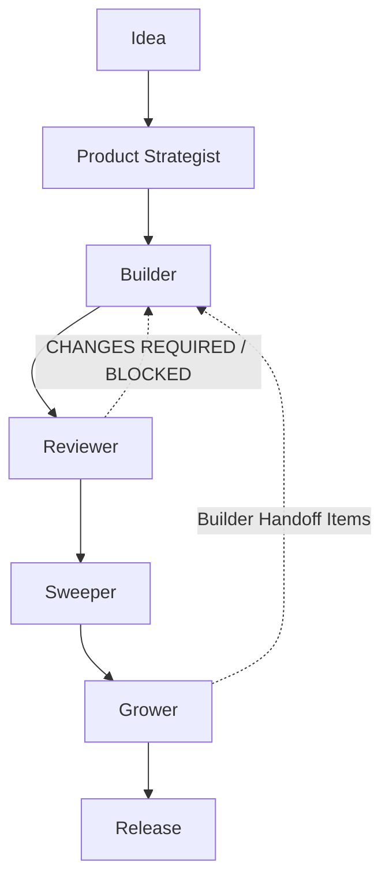

# Agent Orchestration

## Purpose

This document is the Single Source of Truth (SSOT) for how the
template's product development SubAgents — Product Strategist,
Builder, Sweeper, Grower, and Reviewer — are used together: in what
order, with what artifacts handed between them, and under what
conditions a release is safe to ship.

The Agent Orchestrator described here is **not a SubAgent**. It makes
no product decisions, writes no code, performs no review, and designs
no growth experiments. It is traffic control: it says which agent
runs next and what that agent needs to read first.

## Core Principles

- **Single Responsibility** — each agent owns exactly one concern
  (decide / build / simplify / grow / review). No agent performs
  another's job, even when convenient.
- **Artifact-driven workflow** — agents hand off through committed
  `docs/*.md` files, never through verbal instruction alone. If it
  isn't written down, the next agent doesn't know it happened.
- **Human approval gates** — every agent stops after Phase 2 (its
  plan) and again after Phase 4 (its execution) and waits for
  explicit human approval. Partial approval is always allowed.
- **Append-only decision logs** — `product-decisions.md`,
  `growth-decisions.md`, and `review-decisions.md` are append-only.
  Past entries are never edited or overwritten by a later agent run.
- **STOP gates** — 1 invocation = 1 phase. No agent ever continues to
  its next phase in the same response, and no agent skips or
  reorders its phases.
- **SSOT** — each domain has exactly one authoritative artifact
  (product decisions → `docs/product-decisions.md`; growth decisions
  → `docs/growth-decisions.md`; review decisions →
  `docs/review-decisions.md`; agent ordering → this document).

## Roles

### Product Strategist

**責務**: Decide what should be built — MVP scope, product decisions,
user personas, value hypotheses, billing strategy proposals (subject
to CLAUDE.md Section 4-bis), and Builder readiness verdict. Product
Decision ONLY; never implements.

**入力**: docs/product-context.md, docs/mvp-scope.md,
docs/growth-decisions.md, docs/pricing.md, docs/vision.md,
docs/user-feedback.md, prior docs/product-decisions.md entries.

**出力**: docs/product-definition.md (Phase 2), a Readiness verdict —
READY / NOT READY / READY WITH RISKS (Phase 4), a new
docs/product-decisions.md entry (Phase 5).

**次に渡す成果物**: docs/product-definition.md and
docs/product-decisions.md → **Builder**, as required, high-priority,
authoritative context for Builder's own Phase 1 (Explore).

### Builder

**責務**: Implementation ONLY. Converts an approved product
definition into production-quality Django code. Never makes product
decisions, never simplifies on its own judgment, never designs growth
experiments.

**入力**: docs/product-definition.md and docs/product-decisions.md
(read first, authoritative), docs/product-context.md,
docs/mvp-scope.md, docs/growth-decisions.md, apps/, templates/,
tests/, docs/BOUNDARIES.md.

**出力**: docs/implementation-plan.md (Phase 2), committed code in
small purpose-specific commits (Phase 4), an Implementation Report.

**次に渡す成果物**: docs/implementation-plan.md and the shipped
commits → **Reviewer**, for quality and governance review before any
simplification pass.

### Sweeper

**責務**: Simplification ONLY. "Delete over Add" — removes
unnecessary views/URLs/templates/duplication/UI after implementation
has been reviewed. Never adds features, never makes product
decisions.

**入力**: docs/implementation-plan.md, docs/mvp-scope.md,
docs/growth-decisions.md, docs/BOUNDARIES.md, apps/, templates/,
tests/.

**出力**: docs/sweep-plan.md (Phase 2), a Sweep Report with net diff
(Phase 4).

**次に渡す成果物**: the simplified codebase and docs/sweep-plan.md →
**Grower**, as the stable base growth hypotheses are evaluated
against.

### Grower

**責務**: Growth diagnosis and experiment design ONLY — activation,
retention, conversion, pricing/paywall hypotheses, onboarding
hypotheses. Never implements code itself, even for "just copy"
changes.

**入力**: docs/product-context.md, docs/mvp-scope.md,
docs/growth-decisions.md, docs/implementation-plan.md,
docs/sweep-plan.md, docs/metrics.md, docs/pricing.md,
docs/user-feedback.md, docs/experiments.md.

**出力**: docs/growth-plan.md (Phase 2), a Handoff Report of non-code
deliverables and/or Builder handoff briefs (Phase 4), a new
docs/growth-decisions.md entry (Phase 5).

**次に渡す成果物**: non-code deliverables go directly to a human;
code-requiring hypotheses go to **Builder** as a Product-Decision-only
handoff brief (Builder still runs its own Explore → Plan → Human
Approval → Implement cycle).

### Reviewer

**責務**: Review ONLY — implementation quality, architecture, test
quality, CLAUDE.md/docs/BOUNDARIES.md compliance, CLAUDE.md Section
4-bis governance, technical debt, and release readiness. Never fixes
what it finds.

**入力**: CLAUDE.md, docs/BOUNDARIES.md, docs/product-definition.md,
docs/product-decisions.md, docs/implementation-plan.md,
docs/sweep-plan.md, docs/growth-plan.md, docs/growth-decisions.md,
docs/review-decisions.md (if present), apps/, templates/, tests/, CI
config, billing/paywall code.

**出力**: docs/review-plan.md (Phase 2), a Review Report with a
Release Recommendation — APPROVED / APPROVED WITH RISKS / CHANGES
REQUIRED / BLOCKED (Phase 4), a new docs/review-decisions.md entry
(Phase 5).

**次に渡す成果物**: the Release Recommendation → the human
decision-maker for the actual release/merge decision; any CHANGES
REQUIRED or BLOCKED finding → back to **Builder** or **Sweeper**
(whichever owns the affected area) for a new cycle.

## Standard Development Flow

```
Idea
  ↓
Product Strategist
  ↓
Builder
  ↓
Reviewer
  ↓
Sweeper
  ↓
Grower
  ↓
Release
```



Each forward arrow is an artifact handoff, not a verbal one — see
Artifact Flow below for what actually moves between agents. The two
dashed arrows are feedback loops, not alternate happy paths: Reviewer
sends findings back to Builder when a Release Recommendation is
CHANGES REQUIRED or BLOCKED, and Grower sends approved Builder Handoff
Items back to Builder when a growth hypothesis needs a code change.
Both loops re-enter at Builder and must pass through Reviewer again
before Release.

## Artifact Flow

| Agent | Artifact | Purpose |
|---|---|---|
| Product Strategist | docs/product-definition.md | Approved product definition: MVP scope, billing strategy, Builder Readiness Checklist |
| Product Strategist | docs/product-decisions.md | SSOT append-only log of product decisions |
| Builder | docs/implementation-plan.md | Approved implementation plan: architecture, files, models, tests, commit plan |
| Reviewer | docs/review-plan.md | Approved review scope: architecture / code quality / security / testing / governance |
| Reviewer | docs/review-decisions.md | SSOT append-only log of review outcomes and Release Recommendations |
| Sweeper | docs/sweep-plan.md | Approved simplification plan: candidate deletions, duplication, risk assessment |
| Grower | docs/growth-plan.md | Approved growth hypotheses, experiment candidates, Builder handoff items |
| Grower | docs/growth-decisions.md | SSOT append-only log of growth decisions and experiment results |

## Decision Logs

- **docs/product-decisions.md** — Product Strategist's SSOT for
  product decisions (Date, Question, Decision, Reason, Alternatives,
  Expected Result, Risks, Follow-up Date).
- **docs/growth-decisions.md** — Grower's SSOT for growth decisions
  (Question, Evidence, Decision, Reason, Expected Result, Metrics to
  Watch, Follow-up Date).
- **docs/review-decisions.md** — Reviewer's SSOT for review outcomes
  (Date, Review Scope, Findings Summary, Final Recommendation, Risks
  Accepted, Follow-up Actions).

All three are append-only. No agent — including the one that owns the
file — may edit or delete a prior entry; only new entries are added.

## Release Checklist

A release/merge is safe only when all of the following hold:

- [ ] Product Strategist verdict = **READY** (or READY WITH RISKS,
      with risks explicitly accepted by the user)
- [ ] Builder's Definition of Done is fully satisfied
- [ ] Reviewer's Release Recommendation = **APPROVED** or
      **APPROVED WITH RISKS**
- [ ] Sweeper has completed its pass (or the user has explicitly
      decided no sweep is needed this cycle)
- [ ] Grower is **not required** for release — growth work is
      optional and never blocks shipping
- [ ] No open Critical findings in docs/review-decisions.md

If Reviewer's Release Recommendation is **CHANGES REQUIRED** or
**BLOCKED**, do not release; route the findings back to Builder or
Sweeper per the Reviewer role's own handoff guidance.

## Emergency Rules

- **On API disconnection**: every agent phase ends with a STOP block,
  so no more than one phase of work is ever lost. Re-invoke the same
  agent; it determines its current phase from repository state (does
  its plan artifact exist? does it record approval?) rather than from
  conversation memory.
- **On agent failure**: do not skip the failed agent's phase or
  improvise its output on its behalf. Re-run that agent's Phase 1
  (always read-only, always safe) to re-establish state, then proceed
  normally.
- **When the current phase is unclear**: default to that agent's
  Phase 1. It is read-only and safe regardless of what happened
  before.
- **When there is no explicit approval**: no agent may proceed past
  its own Human Approval phase. Silence, ambiguity, or a follow-up
  question is never approval — this applies identically across all
  five agents.
- **On conflicting artifacts**: the newer append-only decision log
  entry takes precedence, unless explicitly superseded by a later
  approved artifact.

## When To Use Each Agent

| Situation | Agent |
|---|---|
| 新機能追加（何を作るか未確定） | Product Strategist → Builder |
| MVPスコープが曖昧、または矛盾がある | Product Strategist |
| 承認済み仕様の実装 | Builder |
| 不要コード・重複・複雑さの削減 | Sweeper |
| 活性化・定着・転換率・価格の改善仮説 | Grower |
| リリース前の品質・ガバナンス確認 | Reviewer |
| 課金/Paywallモデルの変更提案 | Product Strategist（提案のみ。適用には CLAUDE.md Section 4-bis の承認が必要） |
| セキュリティ・アーキテクチャ懸念の点検 | Reviewer |
| ユーザーフィードバックの整理 | Grower |
